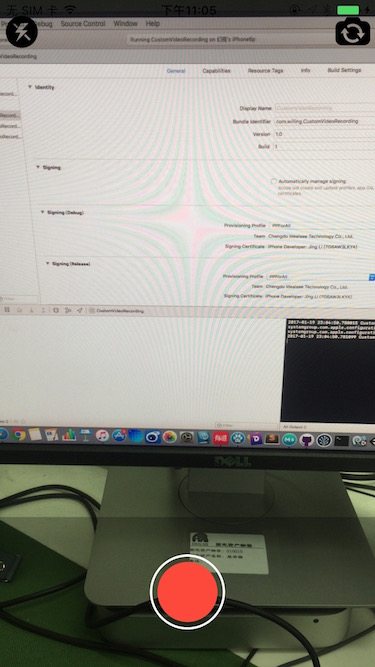
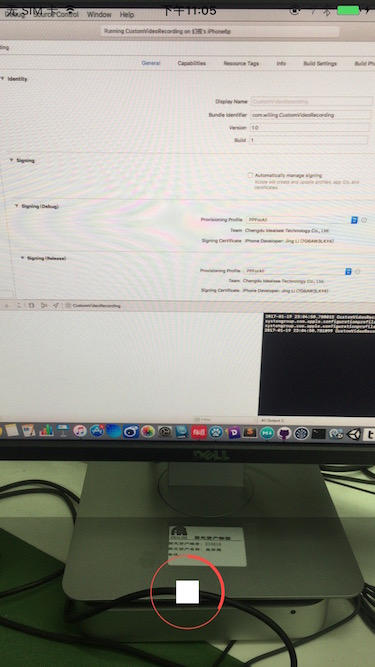
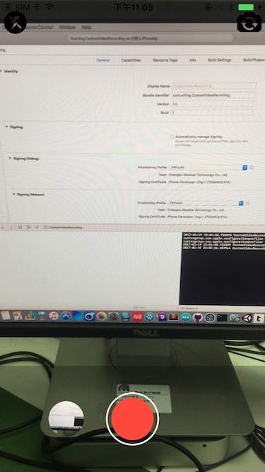
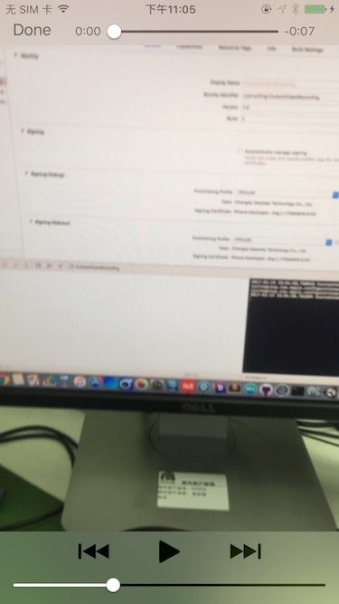

# CustomVideoRecording

**To learn AVFoundation i code this video recording demo.**   
**The following classes are used:**

* AVCaptureVideoPreviewLayer
* AVCaptureSession
* AVCaptureDeviceInput
* AVCaptureVideoDataOutput
* AVCaptureConnection
* AVAssetWriterInput
* AVAssetWriter

## Show Pictures

 
***
 